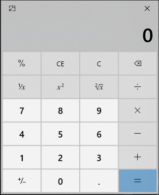

# Calculadora

* Crie uma calculadora ao estilo da calculadora do windows. Essa calculadora deverá permitir a digitação dos valores diretamente no display assim como deverá ser possível entrar com os valores a partir do acionamento de botões na tela(através do clique do mouse). 

* A calculadora deverá permitir ao menos as operações básicas (soma, subtração, multiplicação, exponenciação, radiciação, percentual e inverso (1/x)). 

* A calculadora deverá possuir as funcionalidades de memória:  
MS - memory store   
M+ - memory add  
M- - memory subtract   
MR - memory recall  
MC - memory clear   

**Exemplo:**  
  
  
*O desing não necessáriamente precisa ser igual ao do exemplo. 

**Obs.** 
1.	Desenvolva a solução respeitando as seguintes etapas:  
    a.	Criação da tela em HTML  
    b.	Estilização da tela utilizando CSS  
    c.	Implementação da automação em JavaScript  

2.	O projeto deverá ser versionado com Git e consolidado no repositório remoto Github.  
*Não esqueça de commitar periodicamente. Crie Commits que façam sentido e comente os commits adequadamente. 
