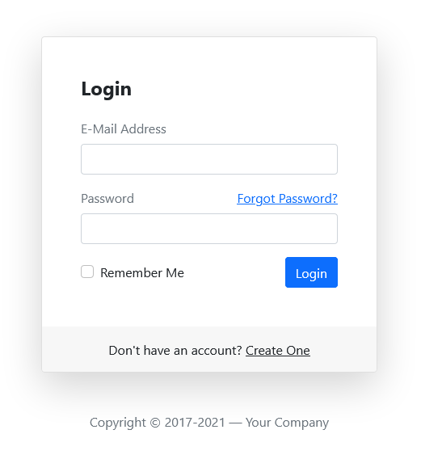

# Angular 
## Lista de Exercícios 2
### Objetivos
- Compreender na prática o conceito de componente do Angular.
- Criar um componente Manualmente.
- Fixar as convenções do Angular.  

#### Palavras Chave  
- Angular, Estrutura do Projeto Angular, Angular Expression(Interpolação), One Way Data Binding, Event Binding, Two Way Data Binding, Criação de componente
- Git, GitHub 
---
### Instruções Adicionais 
- Este exercício será avaliado (vale nota), por tanto, siga fielmente as instruções e nomenclaturas solicitadas (alteração de nomes descontarão pontos). 
- Solicite orientação ao instrutor em caso de inconsistências nas instruções. 

---
### Exercícios 
1. Crie uma nova Branch chamada "lista2" e trabalhe nesta Branch a partir desde ponto. 

2. Adicione bootstrap ao seu Projeto. 

3. Crie um Novo Componente "app-autenticacao". 

    - O Projeto deverá seguir/clonar o seguinte layout: 

    [

    - Abaixo do botão login deverá ser implementado um parágrafo que servirá para exibir mensagens de alerta ao usuário. Criar um atributo "msn" e exibir seu conteúdo no parágrafo.  

    - Estilize e controle o layout com bootstrap. 
  
    - Os campos E-mail e Password deverão ter seu conteúdo salvo instantâneamente nos atributos "email" e "password". 

    - O botão Login deverá acionar o método login(), que alterará o conteúdo do parágrado "msn" com uma das seguintes mensagens: 
        - "Logado!", na cor verde, se usuário e senha informados forem respectivamente "XPTO-21" e "Trocar@123". 
        - "Acesso negado, usuário incorreto", na cor vermelho, se o usuário informado for diferente de "XPTO-21". 
        - "Acesso negado, senha incorreta", na cor vermelho, se a senha informada for diferente de "Trocar@123". 
        - "Usuário Bloqueado!", na cor vermelho, se a **senha** for informada incorretamente mais de 3 vezes consecutivas. 

    - Os links "Forgot Password" e "Create One" serão implementados em exercícios futuros.  

4. Faça o push de suas alterações para o GitHub. 
**Importante:**
- **Não faça o merge** da branch lista2 na master! Neste ponto, seu GitHub deverá ter três ramificações (master, lista1 e lista2). 

