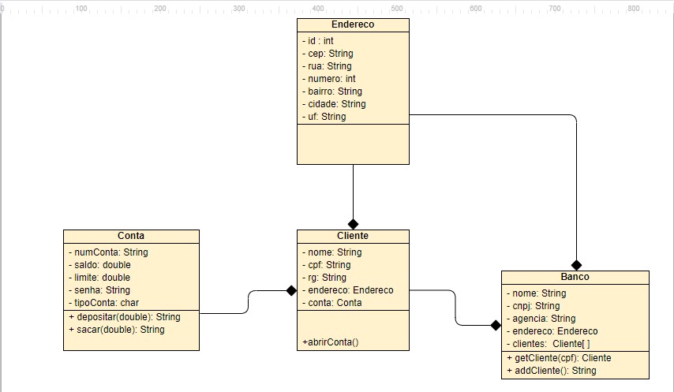

# Java 
## Lista de Exercícios 3
### Objetivos
- Compreender a estrutura de uma classe. 

#### Palavras Chave  

---
### Instruções Adicionais 
- Para cada exercício crie um novo projeto.

--- 
### Exercícios 
1. Criar a classe Calculadora com os seguintes atributos e métodos: 
- Atributos:  memoria

- Métodos: somar(), subtrair(), dividir(), multiplicar(), addMemoria(), clrMemoria(), getMemoria()

- Crie uma classe principal para instanciar a calculadora e fazer alguns calculos... 

2. Crie um programa para gerenciamento de um Banco seguindo o diagrama de classes abaixo. 
- Para todas as classes crie todos os Getters e Setters 
- Crie um construtor com todos os atributos para cada classe
- Encapsule todas as classes usando modificadores de acesso
- Crie uma interface com o usuário com um menu com as seguintes opções: 
    - Menu Gerencial
        - Cadastrar Endereço
        - Cadastrar Cliente 
        - Abrir Conta 
    - Menu Caixa Eletrônico 
        - Deposito 
        - Saque 
        - Saldo 

        