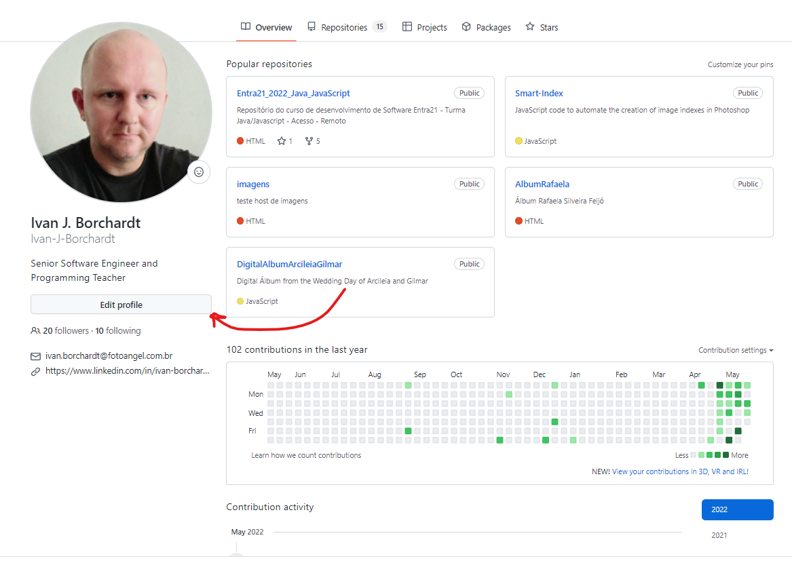

# GitHub  

Eu dei uma passada de olhos nos seus Githubs e notei alguns pontos que podemos melhorar:

1. Muitas pessoas ainda não subiram o repositório dos exercícios, alguns até tem o repositório criado, mas vazio. 

2. Até o presente momento todos deveriam ter pelo menos 2 repositórios no github, o "primeiro_Site" (deve ser públicado usando github pages) e "Entra21_Exercícios_JavaScript".  

3. Muitas contas estão com o perfil mal preenchido. A partir desse ponto o github serve como uma espécie de cartão de visitas. As empresas ancoras, caso tenham interesse, podem visitar seu perfil para acompanhar seu desenvolvimento. 
- **Adicione uma foto no perfil** (de preferencia a mesma que vc usa no perfil do aluno no Entra 21, que também deve ser a mesma no linkeding - isso facilita a identificação e já começa a criar um link visual entre suas mídias digitais...).  E, ajuda o instrutor a identificá-los corretamente ;) ... 

- **User Name:** Muitos estao usando apelidos como User Name do github. Ideal seria usar o próprio nome, já que ele irá compor a URL de seu perfil. Ficar=a mais fácil para as empresas te encontrarem, caso façam uma busca pelo seu nome no google.  A mesma coisa vale para o linkeding. 

- **Preencha o campo nome:** Muitos perfis estão sem nome. Acho que isso dispensa comentários...

- **Campo Bio:** Aqui vai uma breve descrição da sua Bio ou pelo menos seu "Título Profissional", por Exemplo "Desenvolvedor de Software", "DEsenvolvefor FullStack", "Programador Java", etc. Vale até mesmo colocar o título profissional que vc deseja alcançar nos próximos meses (sem exagerar demais, é claro...). Não deixe esse campo em branco e nem tão pouco coloque frases motivacionais ou qualquer coisa do tipo, afinal como vc quer ser encontrado no google? como Profissional da tecnologia ou como poeta?  

- **Preencha os campo de contato:** "Não adianta nada colar o cartás em todos os pontos de onibus da cidade, se não tiver dados de contato, as pessoas simpesmente não entrarão em contato...", certo? 

