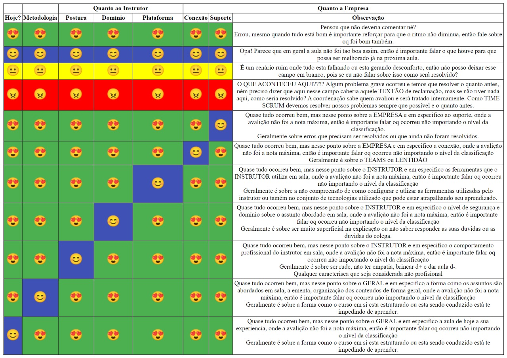

"Aula dada é aula estudada HOJE!" (Pierluigi Piazzi)

"A simplicidade é o mais alto grau de sofisticação" (Leonardo da Vinci)

"o mundo ama os talentosos, mas recompensa os disciplinados" (Autor Desconhecido)

---
## Backlog 

#### Deadline: 2022.06.12
 - [x] Projeto Calculadora

#### Deadline: 2022.06.19
 - [x] Projeto Da Pizza 
 - [x] Análise da questão L5E7 (Usando Debugger)

#### Deadline: 2022.06.26
-  [ ] Projeto casa de cambio 
-  [ ] Projeto site previsão do tempo

#### Deadline: 2022.07.10
-  [ ] Projeto Piloto - Despertador

## Aulas 
### Aula 1 - 2022.04.18 - 4h
- Abertura do curso 

### Aula 2 - 2022.04.19 - 8h
- Introdução à lógica de programação

#### Materiais Complementares - Cursos de Lógica de Programação
- https://www.cursoemvideo.com/

### Aula 3 - 2022.04.20 - 12h
- Introdução à lógica de programação (algoritmo, variáveis, proposições, operadores relacionais, operadores lógicos, operadores aritméticos)  

### Aula 4 - 2022.04.25 - 16h 
- Revisão dos conceitos introdutórios à Lógica de Programação
- Ambientação no Visual Studio Code
- Introdução ao HTML  (Estrutura de um arquivo HTML, Comentários, Tags de Cabeçalho)
- Tags semânticas (header, main, footer, section, nav, article, aside, span)
- Principais Tags do HTML ( Títulos, Parágrafos, Imagens, Links, Listas)
- Um Pouco sobre Formatação com HTML (b, Strong, i, em, big, small, del, s, mark )

#### Materiais Complementares - HTML
- https://www.w3.org/html/ 
- https://pt.wikipedia.org/wiki/HTML 
- https://developer.mozilla.org/pt-BR/docs/Web/HTML 
- https://www.w3schools.com/html/

### Aula 5 - 2022.04.26 - 20h
- HTML (Tabelas, Links, Vídeo, Audio, imagens em outro servidor)
- HTML (Layout baseado em tabelas vs. Layout livre de tabelas (Entendendo o valor semântico das tags do HTML)

### Aula 6 - 2022.04.27 - 24h*
- HTML (Formulários - TAG input e seus vários tipos e atributos) 

### Aula 7 - 2022.04.28 - 28h
- Publicando um site estático no Github Pages 
  - Criando uma conta no Github 
  - Criando o primeiro repositório 
  - Subindo os arquivos e Publicação do Site   

- HTML (Formulários - Textarea, fieldset, button, select, datalist, output)

### Aula 8 - 2022.04.29 - 32h*
- Revisão dos conceitos introdutórios de HTML
- Correcão do Exercício 1 (E1L1)
- Exercícios HTML

### Aula 9 - 2022.05.02 - 36h
- Aprofundando um pouco mais no HTML
    - Boas práticas 
    - Atalhos no VSCode 
    - mais dicas... 
- Correção de Exercícios HTML 

- Revisão rápida dos conceitos de lógica de programação 
- Lógica de Programação com JavaScript
    - Variáveis (tipagem forte vs. tipagem fraca)
    - Conceito de sequencia lógica 
    - Conceito de Sub-Rotina (uma função simples)
- Saída para o console 
- JavaScript (Acessando o DOM)

    
#### Materiais Complementares - JavaScript
- https://www.ecma-international.org/publications-and-standards/standards/ecma-262/
- https://www.w3schools.com/js/js_intro.asp

### Aula 10 - 2022.05.03 - 40h

- Tipos de dados 
- Operadores para testar o tipo da variável 
- Conversão de tipos 
    - Conversão Implícita
    - Conversão Explícita 

- Operadores Aritméticos 

- Exemplos de Manipulação do DOM (capturando Radio button, checkbox,  
  datalist, select, etc)

### Aula 11 - 2022.05.04 - 44h
- Exercícios e revisão pontual da aula anterior 
- Mais sobre operadores Aritméticos 
- Precedência dos calculos aritméticos 
- Potencia Enésima, cálculo percentual, Biblioteca Math (pow, sqrt, PI)

### Aula ID - 2022.05.05 
- Profa. Maiara 

### Aula XX - 2022.05.06 
- Aula cancelada - Instrutor com problemas de internet. 
- A aula será reposta em uma data futura. 
 
### Aula 12 - 2022.05.09 - 48h
- Correção dos exercícios da lista 1 
- Conversão de dados para String, arredondamento, etc
- Conceito de Proposições 
- Estruturas de seleção simples 
- Lista de exercícios 2 

### Aula 13 - 2022.05.10 - 52h
- Resolução Lista de exercícios 2 
- Correção L2E1 até L2E5  

### Aula AM - 2022.05.11 
- Aula Magna  10:00:00 (Horário de Brasília)
- Link: https://us06web.zoom.us/j/81413514668
- Participação obrigatória
- Neste dia não haverá aula a noite

### Aula ID - 2022.05.12
- Profa. Maiara 

### Aula 14 - 2022.05.13 - 56h
- Correção de exercícios L2E6 até L2E10 
- Estruturas de seleção compostas, case, ternário 
- Lista de exercícios 3 
- Desafio da pizza (Para executar no final de semana)

### Aula 15 - 2022.05.16 - 60h
- Correção de exercícios 
- Condicionando o racíocinio lógico com o emprego de boas práticas
- Introdução à Git e GitHub 
    - Instalação do Git 
    - git init, git add ., git commit, git remote, git push, git Clone

### Aula 16 - 2022.05.17 - 64h
- Estruturas de repetição 
- Lista de Exercícios 4 

### Aula 17 - 2022.05.18 - 68h
- Estruturas de repetição 
- Lista de Exercícios 5

### Aula ID - 2022.05.19 
- Profa. Maiara 

### Aula 18 - 2022.05.20 - 72h
- Tempo para resolução da lista 5 
- Revisão geral sobre lógica de programação 
- Correção L3E6 e L3E7

### Aula 19 - 2022.05.23 - 76h
- Correção L3E8, L3E9, L3E10
- Correção lista 5 (até E7) 
- ** A questao 7 ainda está com um erro de lógica, ficou como desafio para resolver em casa
- ** As questoes 9 e 10 serão objeto de avaliação, prazo de entrega: 30.06.22

### Aula 20 - 2022.05.24 - 80h 
- Estrutura de dados
-   Arrays 
-   Pilhas e Filas
- Lista de Exercícios 6

### Aula 21 - 2022.05.25 - 84h
- Correção Lista 6
- Funções Nomeadas 
- Funções Anônimas 
- Arrow Functions 
- Funções auto-invocadas 
- Ideia de subrotina 
- Escopo das variaveis 
- Lista de Exercícios 7 

### Aula ID - 2022.05.26 
- Profa. Maiara 

### Aula 22 - 2022.05.27 - 88h
- Desafio da calculadora
- CSS - Sintaxe, Onde declarar, Comentários 
- CSS - Seletores (Elemento, id, Classe, Universal)
- CSS - Propriedades Background, Color 
- CSS - Formatação de texto e fontes   

#### Materiais Complementares - CSS
- https://www.w3schools.com/css/default.asp

### Aula 23 - 2022.05.30 - 92h
- CSS - Especificidade de seletores 
- CSS - Margens, Padding, Bordas, outline, Box Model 
- CSS - Formatação de Formulários
- CSS - Display, Elementos de Bloco x Elementos de linha 

### Aula 24 - 2022.05.31 - 96h
- Git Fetch e Git Pull
- CSS - Formatação para Links, Listas e Tabelas 
- CSS - Um pouco mais sobre formatação de textos, fontes e bordas
- CSS - CSS Reset e CSS Normalize
- CSS - Responsividade (Media Query, viewport)

### Aula 25 - 2022.06.01 - 100h*
- Tempo para resolver exercícios da lista 7 e desafio da calculadora

### Aula ID - 2022.06.02 
- Profa. Maiara 

### Aula 26 - 2022.06.03 - 104h
- Correção Lista 7
- Formas de iterar um Array
- Funções para trabalhar com arrays (Map, Filter, Reduce, Concat)
- Passando uma função como parâmetro 

### Aula 27 - 2022.06.06 - 108h (Instrutor sem Internet)
- Tempo para resolver Lista 7 

### Aula 28 - 2022.06.07 - 112h
- Correção Lista 7
- Debug do Chrome
- Algoritmo de ordenação Buble Sort e função array.sort()
- Eventos em JavaScript
- Janelas de confirmação
- Projeto: Desafio da Pizza

### Aula 29 - 2022.06.08 - 116h
- Correção L7E2 e L7E5
- Revisão das aulas anteriores 
- Reforço de lógica de programação

### Aula ID - 2022.06.09
- Profa. Maiara 

### Aula 30 - 2022.06.10 - 120h
- Tempo para resolver Lista 7, Projeto da calculadora,
 Projeto da Pizza e Análise da questão L5E7 (Usando Debugger)

### Aula 31 - 2022.06.13 - 124h
- JavaScript Object
- JSON e XML
- Programação assíncrona com AJAX
- Consumo de uma API REST
- Entender a arquitetura Cliente/Servidor
- Projeto: Conversor de moedas com base na API do banco central

### Aula 32 - 2022.06.14 - 128h
- Reforço processamento assíncrono e consumo de API
- Tempo para Trabalhar no projeto Conversor de Moedas
https://dadosabertos.bcb.gov.br/dataset/dolar-americano-usd-todos-os-boletins-diarios/resource/ae69aa94-4194-45a6-8bae-12904af7e176

### Aula 33 - 2022.06.15 - 132h
- JavaScript em arquivos externos e onde declarar 
- Processamento Assíncrono com Async/Await
- Projeto: Site Previsao do Tempo (API: https://hgbrasil.com/status/weather)

### Feriado - 2022.06.16
- Feriado?? Bom pra resolver o desafio da aula ;) 

### Feriado - 2022.06.17
- Feriado duplo??? :) - WoW - Perfeito para colocar as pendências da aula em dia, hein? ;)  

### Aula 34 - 2022.06.20 - 136h
- Dicas off topic: 
- Trabalhando com a data do sistema 
- Vetor de vetores (Matrizes)
- Ordenando uma matriz tomando uma coluna como critério de ordenação
- Capturando elementos da tela pelo formulário e a propriedade name dos elementos
- Criando elementos HTML através da propriedade innerHTML
- Criando elementos HTML através da função document.write()
- Criando elementos HTML através da dunção document.createElement() e appendChield() 

### Aula 35 - 2022.06.21 - 140h - Instrutor com problemas de internet
* Por conta dos problemas de internet metade da aula foi 
redirecionada para resolução de exercícios e trabalhos
- Introducao ao NodeJs
- Módulos
- Criando o primeiro servidor http
- NPM e NPX
- Instalando dependências no projeto Node
- Criando uma API com o Framework Express
- Exercícios: NodeJs - Lista 01

#### Materiais Complementares - Node
- https://nodejs.org/pt-br/docs/
- Tutorial Node (Inglês)       : https://www.youtube.com/watch?v=TlB_eWDSMt4
- Tutorial Node (Português)    : https://www.youtube.com/watch?v=gq9uGdZCKxI

### Aula 36 - 2022.06.22 - 144h
- Continuação aula de NODE

### Aula ID - 2022.06.23
- Profa. Maiara 

### Aula 37 - 2022.06.24 - 148h

- Git e GitHub para trabalho em equipes
- Introducao à medotologias ágeis na prática (Cerimônias, Papéis, Backlog, Quadro Kanban, Sprint e Daily)
- Divisao da turma em equipes
- Projeto Piloto: Backlog, Divisão de taréfas (Daily), quadro Kanban e Git/GitHub

#### Materiais Complementares - Markdown
- https://www.markdownguide.org/basic-syntax/  

#### Materiais Complementares - GitHub  
- https://docs.github.com/pt/get-started/quickstart/github-flow  
  
#### Materiais Complementares - Scrum e Kanban 
- 999-Biblioteca/EBOOK Guia do Scrum em Português.pdf
- 999-Biblioteca/EBOOK Guia do Método Kanban em Português.pdf
- Tutorial Trello            : https://www.youtube.com/watch?v=0Uqf_DLbAUU
- Tutorial alternativo Trello: https://www.youtube.com/watch?v=ib7kWfbPuL0

### Aula 38 - 2022.06.27 - 152h

### Aula 39 - 2022.06.28 - 156h
- Execução do projeto Piloto
- 

### Aula 40 - 2022.06.29 - 160h
- Execução do projeto Piloto
- Pegando parametros no Endpoint pelo método GET (req.query.xxx) 
- Consistindo dados em arquivos (módulo fs do NODE)
- Consumo de API no Backende com Axios

### Aula ID - 2022.06.30
- Profa. Maiara 

### Aula 41 - 2022.07.01 - 164h*
- Finalização do projeto Piloto

### Aula 42 - 2022.07.04 - 168h
- Introdução ao TypeScript
- Como adicionar TypeScript a um projeto
- Como compilar/transpilar o TS 
- Tipos de Dados primitivos 
- Tipagem de variáveis por inferência e por anotation
- Tipos de Dados Object 
    - Arrays (coleções de dados homogêneos, coleções de dados heterogêneos(tuplas))
    - Literal Object
- Tipo de dados Any 
- Union Type
- Type Alias
- Literal Types
- Tipagem dos parâmetros das funções
- Tipagem do retorno das funções 
- Funções com parâmetros opcionais 

- Exercícios: L5E9 

#### Materiais Complementares - TypeScript
https://www.typescriptlang.org/

### Aula 43 - 2022.07.05 - 172h
- Correção dos Exercícios 
- Interfaces
- Narrowing
- Generics 
- Classes (introdução à OO)
    - Atributos 
    - Métodos 
    - Construtores 
- Exercícios (Definir classes e Instanciar Objetos)

### Aula 44 - 2022.07.06 - 176h
- Correção dos Exercícios 
- Interfaces para Classes
- Encapsulamento 
    - modificadores de acesso 
    - Métodos Getter e Setter 
    - Métodos de Trabalho  

- Herança 
- Atributos e Métodos Estáticos 
- Exercícios

### Aula ID - 2022.07.07
- Profa. Maiara 

### Aula 45 - 2022.07.08 - 180h
- Correção de exercícios 
- Reforço Classes, OO, Encapsulamento
- Novos Exercícios

### Aula 46 - 2022.07.11 - 184h
- Correção Exercícios TypeScript - OO
- Finalização Trabalhos e Exercícios 

### Aula 47 - 2022.07.12 - 188h
- Finalização Trabalhos e Exercícios 

### Aula 48 - 2022.07.13 - 192h
- Finalização Trabalhos e Exercícios 

### Aula ID - 2022.07.14
- Profa. Maiara

### Aula CF - 2022.07.15
- Prof. Sergio

### Aula 49 - 2022.07.18 - 196h *
- Criando um Readme.md com Markdown
- .gitignore
- Tratamento de conflito no GitHub
- bootstrap

#### Materiais Complementares - Markdown
- https://www.markdownguide.org/getting-started/
- https://daringfireball.net/projects/markdown

### Aula 50 - 2022.07.19 - 200h
- bootstrap 
- Prototopagem de tela
    - Figma 
    - Icones 
    - Palheta de cores    
- Inicio do projeto de conclusão de curso
    - Equipes
    - Concepção da ideia 
    - Descrição Funcional 
    - Mockup das Telas  

### Aula XX - 2022.07.20 - Férias

### Aula 51 - 2022.08.01 - 204h
- Auto-Avaliação
- Apresentação Projeto Despertador (Live Demo)
- Apresentação Projeto Site Previsão do tempo (Live Demo)
- Revisão TypeScript 

### Aula DH - 2022.08.02 
- Profa. Natali

### Aula 52 - 2022.08.03 - 208h
- Revisão TypeScript 

### Aula ID - 2022.08.04 
- Profa. Clara

### Aula 53 - 2022.08.05 - 212h
- Revisão TypeScript

### Aula 54 - 2022.08.08 - 216h
- Correção Exercício OO TypeScript

- Introdução Angular
- Instalação
- Angular CLI 
- Criando uma nova Aplicação
- Entendendo a estrutura da aplicação Angular
- Componentes e sua estrutura
- Comunicação entre HTML e JS
    - Angular Expression (Interpolação)
    - One Way Data Binding
    - Event Binding 

#### Materiais Complementares - Angular 
- https://github.com/angular/angular-cli
- https://angular.io/cli

- https://www.youtube.com/c/loianegroner
- https://www.youtube.com/watch?v=Yf0rC7dERjg

### Aula DH - 2022.08.09 
- Profa. Natali

### Aula CP - 2022.08.10 
- Ciclo de Palestras

### Aula ID - 2022.08.11
- Profa. Clara

### Aula 55 - 2022.08.12 - 220h
- Revisão aula anteriror 
- Mais detalhes sobre Event Binding 
- Exercícios 

- Onde declarar CSS
- Adicionando Bootstrap ao Angular 

- Two way Data Binding
- Convenção de nomenclaturas no Angular
- Criando o Primeiro Componente Angular 
- Inbound properties 
- Exercícios 

### Aula 56 - 2022.08.15 - 224h
- Apresentação Protótipo Projeto Final  
**Angular**

- Trabalhando One Way Data Binding com Inbound Properties

- Interfaces
- Feature Module - Organizando os Módulos
- ng generate ...   https://angular.io/cli/generate
- Diretiva ngFor
- Diretiva ngIf
- Diretiva ngSwich 
- Diretiva ngStyle
- Diretiva ngClass
- Exercícios   

### Aula DH - 2022.08.16 
- Profa. Natali

### Aula 57 - 2022.08.17 - 228h
- LifeCycle Hooks (Ciclo de Vida do Componente)
- Arquitetura Cliente-Servidor 
- Services 
- Consumindo uma REST API
- Angular DevTools
    https://chrome.google.com/webstore/detail/angular-devtools/ienfalfjdbdpebioblfackkekamfmbnh/related

### Aula ID - 2022.08.18
- Profa. Clara

### Aula 58 - 2022.08.19 - 232h
- Conceito de Single Page Aplication (SPA)
- Pipe operator 

---
## Onde Encontrar mais...

- Chrome DevTools 

        Segredos do Chrome DevTools - Ep. 1: Elements (Portuguese)

- Canal do Google 
        https://www.youtube.com/googlecode

---
## Ferramentas (Setup) 

**Visual Studio Code**
~~~
        https://code.visualstudio.com
~~~

**Google Chrome**
~~~
        Download Google Chrome: 
            https://www.google.pt/intl/pt-PT/chrome/

        Tutorial de Instalacao do Google Chrome: 
            https://canaltech.com.br/navegadores/como-instalar-o-google-chrome/
            https://support.google.com/chrome/answer/95346?hl=pt&co=GENIE.Platform%3DDesktop

        Extensão do Google Tradutor para o Chrome: 
            https://canaltech.com.br/utilitarios/conheca-a-extensao-do-google-tradutor-para-o-chrome/

~~~

**Git**
~~~
        https://git-scm.com/
~~~

**NodeJS**

~~~
        https://nodejs.org/en/download/
~~~

**Java JDK**
~~~
        Oracle:
            https://docs.oracle.com/en/java/javase/18/install/preface.html#GUID-A1E4DD95-DA5E-4441-BFCD-2E8AE63C573D
                
        Open JDK Zulu: 
            https://www.azul.com/downloads/?package=jdk

        Como Instalar: 
            https://www.youtube.com/watch?v=laC0fiI-IOM
~~~

**Eclipse**
~~~
        https://wiki.eclipse.org/Eclipse/Installation
~~~

**Postman**
~~~
        https://www.postman.com/downloads/
~~~

**PostgreSQL** 
~~~
        https://www.postgresql.org/
~~~

**Lightshot**
~~~
        https://app.prntscr.com/pt-br/download.html
~~~

## Links úteis 

 

Planilha Entrega de Exercícios: https://docs.google.com/spreadsheets/d/1uzgzau9SHCGINTxFawSdd3ksCsgg29LyPv8_nAGOh-U/edit?usp=sharing
        
Central do Aluno:   https://externo.proway.com.br/login-aluno

Login: E-mail do cadastro no Entra21 

Senha inicial: data de nascimento no formato: ddmmaaaa

### Como devo proceder na avaliação diária?

Sala 1 no Teams (é onde temos as aulas):

https://teams.microsoft.com/l/meetup-join/19%3ameeting_N2U1NDA0ZjEtNjYyNi00ZjY4LWI5NGUtYmQ1MDRmZTA2Yzg0%40thread.v2/0?context=%7b%22Tid%22%3a%2211bd213a-7403-4997-88b5-fa787aee4e78%22%2c%22Oid%22%3a%227a378a2b-683e-48dc-82bf-630c15f588e8%22%7d

Sala 2 no Teams (Sala para troca de ideias sobre os projetos em desenvolvimento): 

https://teams.microsoft.com/l/meetup-join/19%3ameeting_Njg1ZGM3YjktZThkZC00MDVhLTkwYWUtZTg0MGM0NDE2Njg3%40thread.v2/0?context=%7b%22Tid%22%3a%2211bd213a-7403-4997-88b5-fa787aee4e78%22%2c%22Oid%22%3a%227a378a2b-683e-48dc-82bf-630c15f588e8%22%7d

Workspace do Trello: 
https://trello.com/invite/entra2120221/d1a1649d47aecbd6a7d05ce3500a0342

## Instrutor 

Ivan J. Borchardt

[99256_2268-WhatsApp-25D366?style=for-the-badge&logo=whatsapp&logoColor=white)](https://wa.me/qr/DRQRLT3OIOMQJ1)         

 

 
## Monitor

Matheus Ledra

[99244_8377-WhatsApp-25D366?style=for-the-badge&logo=whatsapp&logoColor=white)](https://wa.me/qr/DRQRLT3OIOMQJ1)   

## Coordenador

Felipe Grillo

99969_4674-WhatsApp-25D366?style=for-the-badge&logo=whatsapp&logoColor=white) 

### License
This project is under the MIT license.

